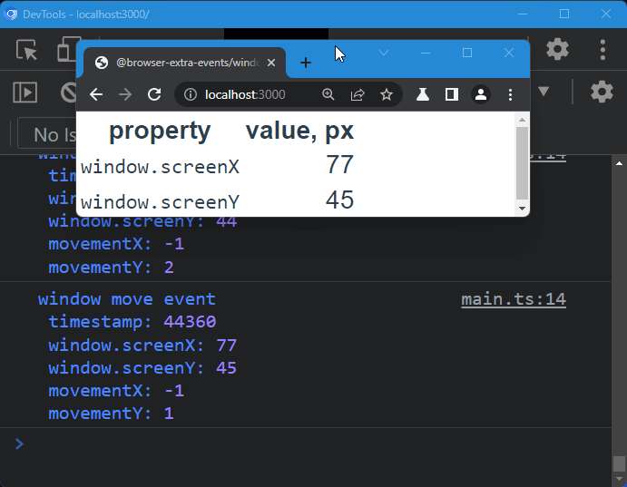
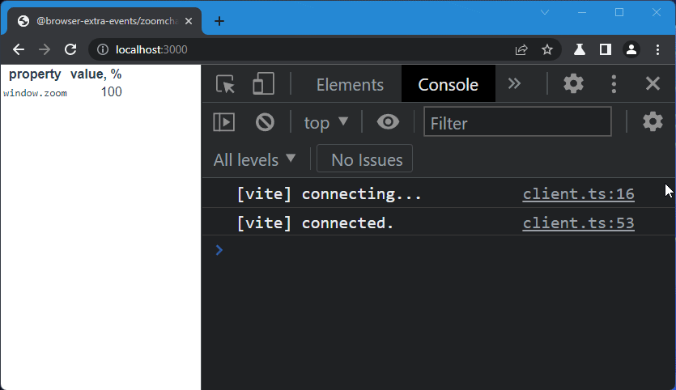
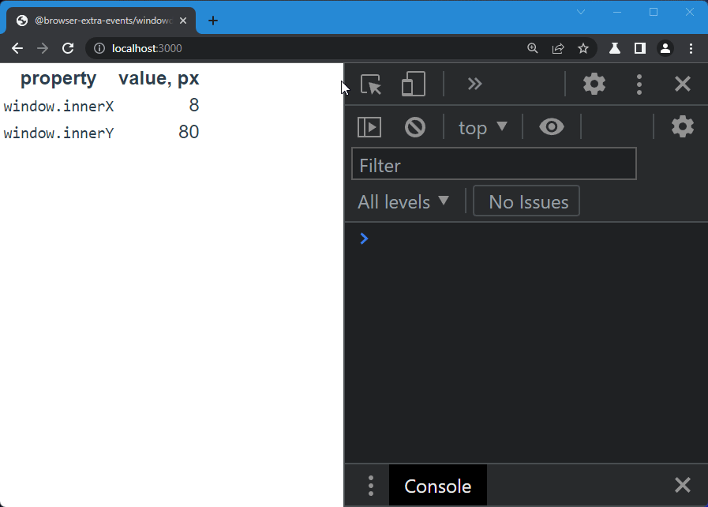

# browser-extra-events

## windowmove

Fires `move` [`event`] on [`window`] each time [`window.screenX`] or [`window.screenY`] are changed.



### Usage

With bundlers:

```
npm install @browser-extra-events/windowmove
```

and

```js
import '@browser-extra-events/windowmove'
```

Plain html:

```html
<script
  src="https://cdn.jsdelivr.net/npm/@browser-extra-events/windowmove/dist/windowmove.min.js">
</script>
```

## zoomchange

Fires `zoom` event on [`window`] each time user changes browser zoom ratio.



### Usage

With bundlers:

```
npm install @browser-extra-events/zoomchange
```

and

```js
import '@browser-extra-events/zoomchange'
```

Plain html:

```html
<script
  src="https://cdn.jsdelivr.net/npm/@browser-extra-events/zoomchange/dist/zoomchange.min.js">
</script>
```

## windowdisplace

Fires `displace` event on [`window`] each time the inner window changes its position relative to upper-left corner of the browser window.

> NOTE: It relies on mouse events, therefore to catch viewport reposition the user pointer (mouse) should be inside the client viewport. 



### Usage

With bundlers:

```
npm install @browser-extra-events/windowdisplace
```

and

```js
import '@browser-extra-events/windowdisplace'
```

Plain html:

```html
<script
  src="https://cdn.jsdelivr.net/npm/@browser-extra-events/windowdisplace/dist/windowdisplace.min.js">
</script>
```

## screenchange

### Usage

With bundlers:

```
npm install @browser-extra-events/screenchange
```

and

```js
import '@browser-extra-events/screenchange'
```

Plain html:

```html
<script
  src="https://cdn.jsdelivr.net/npm/@browser-extra-events/screenchange/dist/screenchange.min.js">
</script>
```

## fullscreenchange

Fires `fullscreenchange` event on browser fullscreen enter/exit.

### Usage

With bundlers:

```
npm install @browser-extra-events/fullscreenchange
```

and

```js
import '@browser-extra-events/fullscreenchange'
```

Plain html:

```html
<script
  src="https://cdn.jsdelivr.net/npm/@browser-extra-events/fullscreenchange/dist/fullscreenchange.min.js">
</script>
```

[`window`]: https://developer.mozilla.org/en-US/docs/Web/API/Window
[`event`]: https://developer.mozilla.org/en-US/docs/Web/API/Event
[`window.screenX`]: https://developer.mozilla.org/en-US/docs/Web/API/Window/screenX
[`window.screenY`]: https://developer.mozilla.org/en-US/docs/Web/API/Window/screenY